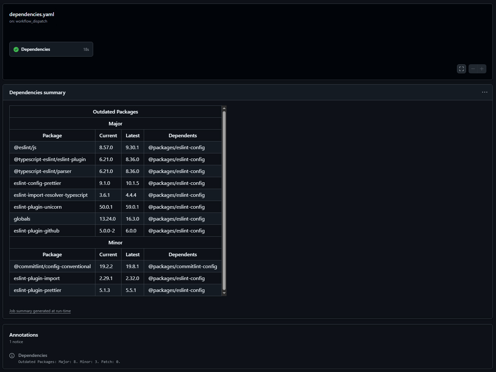

# PNPM Outdated - Github Action


[](https://github.com/SStranks/pnpm-outdated/actions/workflows/github-code-scanning/codeql)
[](https://github.com/SStranks/pnpm-outdated/actions/workflows/lint.yaml)
[](https://github.com/SStranks/pnpm-outdated/actions/workflows/dependencies.yaml)

**A GitHub Action that runs `pnpm outdated` and generates a clean, summarized table of outdated dependencies directly in the GitHub Actions UI.**

## Table of Contents

- [Features](#features)
- [Requirements](#requirements)
- [Setup](#setup)
- [Usage](#usage)
- [Example Output](#example-output)
- [License](#license)

---

## Features

- Automatically checks for outdated dependencies using `pnpm outdated`
- Generates a clean Markdown summary table in the GitHub Actions UI
- Works with monorepos (via recursive option)
- Fast and lightweight, powered by `pnpm` and TypeScript
- Simple to integrate into any GitHub Actions workflow

---

## Requirements

- Node.js v18 or later
- `pnpm` v7 or later
- GitHub Actions environment
- A `pnpm-lock.yaml` file checked into your repo

---

## Setup

Add the action to your workflow file (e.g., `.github/workflows/dependencies.yaml`):

```yaml
name: Check for outdated dependencies

on:
  workflow_dispatch:
  schedule:
    - cron: '0 6 * * 1' # every Monday at 6 AM UTC

jobs:
  pnpm-outdated:
    runs-on: ubuntu-latest

    steps:
      - name: Checkout repository
        uses: actions/checkout@v4

      - name: Use PNPM
        uses: pnpm/action-setup@v2
        with:
          version: 8

      - name: Set up Node.js
        uses: actions/setup-node@v4
        with:
          node-version: 18
          cache: 'pnpm'

      - name: Install dependencies
        run: pnpm install --frozen-lockfile

      - name: Run pnpm-outdated action
        uses: SStranks/pnpm-outdated@v1
```

## Usage

By default, the action runs pnpm outdated and posts a summary of outdated packages directly to the workflow run's summary view.

Inputs (optional)
Name Type Description Default
recursive boolean Run pnpm outdated -r for monorepos false
filter string Apply a filter to workspaces (if recursive) (none)

Example (monorepo):

```yaml
- name: Run pnpm-outdated recursively
  uses: SStranks/pnpm-outdated@v1
  with:
    recursive: true
    filter: 'packages/*'
```

## Example Output



## License

The scripts and documentation in this project are released under the MIT License
